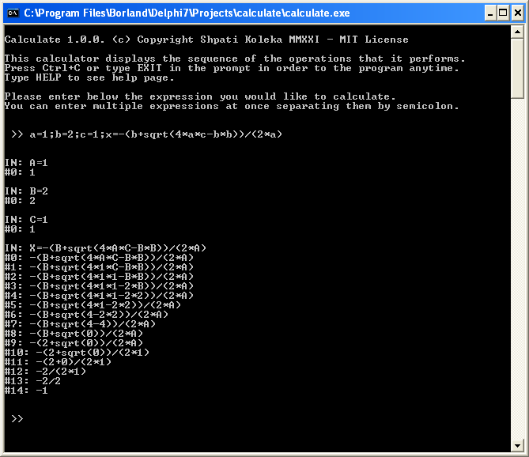

# Calculate
Calculate is small console program for making calculations and displaying the sequence of operations.
The program can be used as an educational tool for teaching students how to perform arithmetic operations.  

Some of the program features are:
- Displays the sequence of the operations that it performs.
- It supports these functions: sin, cos, tan, exp, ln, log, sqrt.
- It includes these pre-defined constants: pi=3.141...; phi=1.618...');
- Up to 256 user-defined variables/constants and an ability to view and reset them. 
- Recognizes multiple expressions at once if they are separated them by semicolons.
  
  Example 1: 
  `>> a=1;b=2;c=1;x=-(b+sqrt(4*a*c-b*b))/(2*a)`
  
  Example 2:
  `>> a=1;exp(1)`

- You can also enter the expression to be calculated as a command line argument when calling the program:

  Example 1:
  `calculate.exe a=1;b=2;c=1;x=-(b+sqrt(4*a*c-b*b))/(2*a)`

  Example 2:
  `calculate a=1;exp(1)`

Calculate 1.0 (c) Copyright Shpati Koleka MMXXI - MIT License
